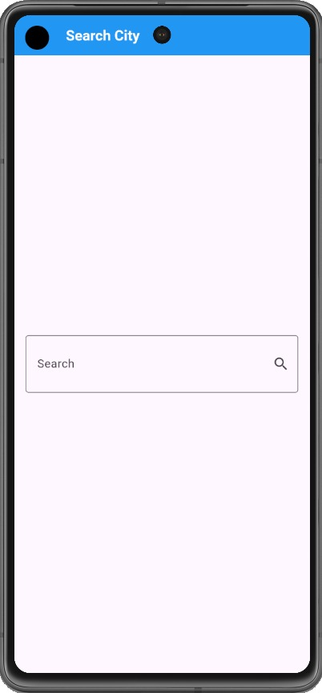
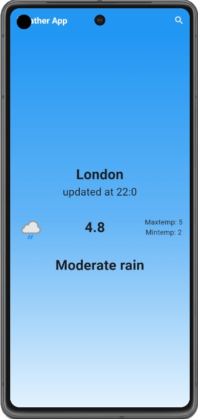
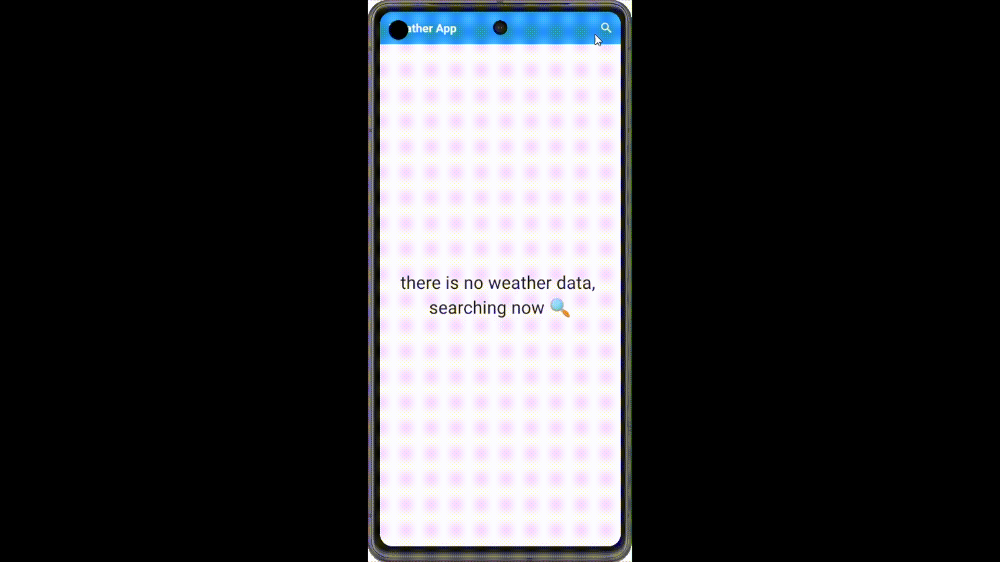

# Weather App

A Flutter-based weather application that provides real-time weather updates for cities worldwide using the [WeatherAPI](https://www.weatherapi.com/). Users can search for a city to view the current weather, including temperature, conditions, and other details, presented with a dynamic interface.

## Table of Contents

- [Features](#features)
- [Demo](#demo)
- [Setup](#setup)
- [Configuration](#configuration)
- [Project Structure](#project-structure)
- [Dependencies](#dependencies)

## Features

- **Search City Weather**: Enter a city name to fetch and display real-time weather updates.
- **Dynamic Theming**: The app theme adapts based on the weather conditions (e.g., sunny, cloudy, rainy).
- **Detailed Weather Info**: Displays city name, temperature, weather condition, high/low temperatures, and an icon representing the condition.
- **Error Handling**: Informs the user if an error occurs (e.g., invalid city name or network issue).

## Demo
Here’s a preview of the Weather App in action:

<p align="center">
  
  
  
</p>

### Video/GIF Demo
Watch the app in action:



## Setup

1. **Clone the repository**
   ```bash
   git clone https://github.com/NadaAlaa1/weather-app.git
   cd weather-app

2. **Install dependencies** Ensure Flutter is installed on your system. Then, run the following command:
   ```bash
   flutter pub get

3. **Obtain WeatherAPI Key**
   - Visit [WeatherAPI](https://www.weatherapi.com/) and create a free account to obtain an API key.
   - Copy the API key.

4. **Add the API Key** Replace the placeholder `YOUR_API_KEY_HERE` in the `WeatherService` class with your actual API key.
   Open `lib/services/weather_service.dart` and update the following line:

   ```dart
   final String apiKey = 'YOUR_API_KEY_HERE';

5. **Platform-Specific Configuration**
   - **Android**: Add internet permission in `android/app/src/main/AndroidManifest.xml`:

     ```xml
     <uses-permission android:name="android.permission.INTERNET"/>

6. **Run the App**
   ```bash
   flutter run

## Configuration

- **API**: This app uses [WeatherAPI](https://www.weatherapi.com/) to fetch weather data.
- **Themes**: The app uses dynamic theming to enhance user experience based on weather conditions.

## Project Structure

Here’s a brief overview of the key folders and files in this project:
- **lib/main.dart**: Entry point of the application.
- **lib/cubits**: Contains state management logic using `flutter_bloc` for handling weather data.
- **lib/models**: Defines the `WeatherModel` class for parsing weather data.
- **lib/services**: Handles API requests with the `WeatherService` class using `Dio`.
- **lib/views**: Contains UI screens such as `HomeView` and `SearchView`.
- **lib/widgets**: Holds reusable UI components like `WeatherInfoBody` and `NoWeatherBody`.

## Dependencies

- **flutter_bloc**: For state management and UI interaction.
- **dio**: A powerful HTTP client for Dart, used for making API requests.
- **flutter**: The main framework for building the application.

Install these dependencies by running:
```bash
flutter pub get
